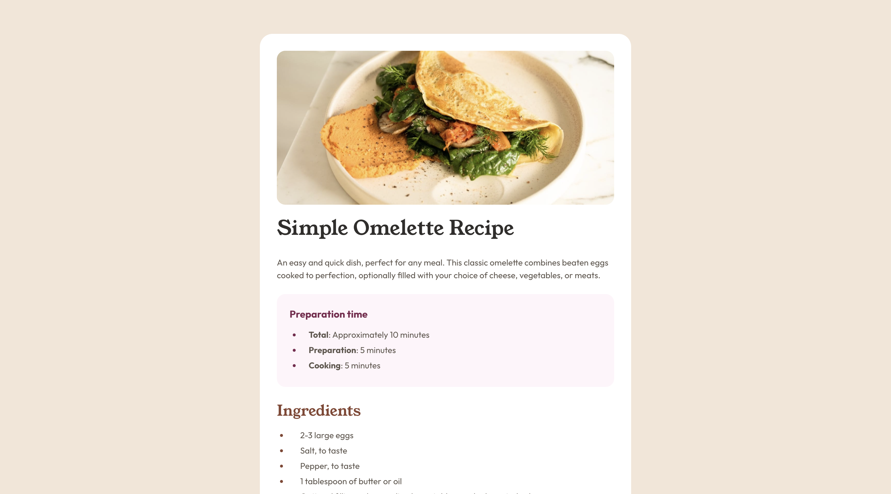

# Frontend Mentor - Recipe page solution

This is a solution to the [Recipe page challenge on Frontend Mentor](https://www.frontendmentor.io/challenges/recipe-page-KiTsR8QQKm).

## Table of contents

- [Overview](#overview)
  - [Screenshot](#screenshot)
  - [Links](#links)
- [My process](#my-process)
  - [Built with](#built-with)
  - [What I learned](#what-i-learned)
  - [Useful resources](#useful-resources)
- [Author](#author)

## Overview

### Screenshot



### Links

- Live Site URL: <a href="https://frontendmentor-recipe-page-62856.web.app/" target="_blank">Click Here</a>

## My process

### Built with

- HTML5
- CSS
- CSS Flex
- CSS Grid
- Hosting - Firebase
- HTML Table
- CSS Media Query

### What I learned

I learned how to use flex, grid, table and media queries in CSS. Especially tables to display the nutritional information. I found it very confusing at the start as I didn't how to display the nutritional information. I was trying to display it using CSS Grid but it was not working as expected. Then I found out that I can use tables to display the nutritional information combined with CSS Grid. I also learned how to use media queries to make the website responsive.

```html
<table>
	<tr>
		<td>Calories</td>
		<td class="value">277kcal</td>
	</tr>
	<tr>
		<td>Carbs</td>
		<td class="value">0g</td>
	</tr>
	<tr>
		<td>Protein</td>
		<td class="value">20g</td>
	</tr>
	<tr>
		<td>Fat</td>
		<td class="value">22g</td>
	</tr>
</table>
```

```css
table {
	width: 100%;
	border-collapse: collapse;
}

tr {
	display: grid;
	grid-template-columns: repeat(2, 1fr);
	padding: 0.8rem;
	padding-left: 2rem;
	border-bottom: 1px solid var(--clr-s150);
}

tr:last-child {
	border-bottom: none;
}

.value {
	color: var(--clr-b800);
	font-weight: 700;
}
```

### Useful resources

- <a href="https://css-tricks.com/snippets/css/a-guide-to-flexbox/" target="_blank">Flexbox</a> - This helped me understand and how to use flex.
- <a href="https://developer.mozilla.org/en-US/docs/Web/HTML" target="_blank">Learning HTML</a> - This website helped me understand different tags and elemetns in HTML.
- <a href="https://developer.mozilla.org/en-US/docs/Web/CSS" target="_blank">Learning CSS</a> - This website helped me understand different properties and values in CSS.
- <a href="https://css-tricks.com/snippets/css/complete-guide-grid/" target="_blank">Grid</a> - This helped me understand and how to use grid.
- <a href="https://developer.mozilla.org/en-US/docs/Learn/HTML/Tables/Basics" target="_blank">CSS Table</a> - This helped me understand and how to use table.
- <a href="https://developer.mozilla.org/en-US/docs/Web/HTML/Element/td" target="_blank">CSS Table</a> - This helped me understand and how to use table.
- <a href="https://developer.mozilla.org/en-US/docs/Web/CSS/CSS_media_queries/Using_media_queries" target="_blank">Learning Media Queries</a> - This website helped me understand how to use media queries in CSS.

## Author

- Linkedin - [Jaweed Inayathulla](https://www.linkedin.com/in/jaweedinayathulla/)
- Frontend Mentor - [@InaJaweed](https://www.frontendmentor.io/profile/InaJaweed)
